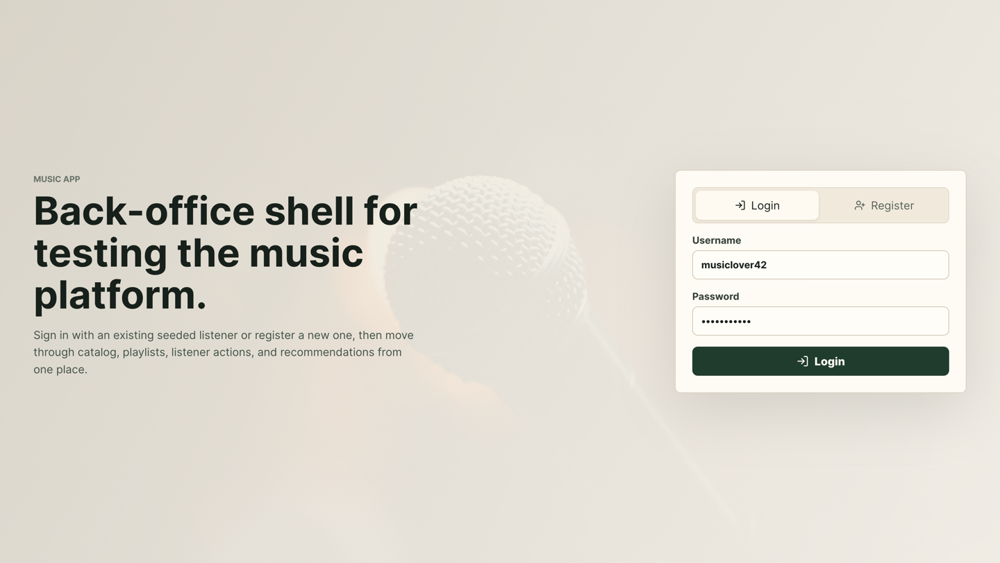
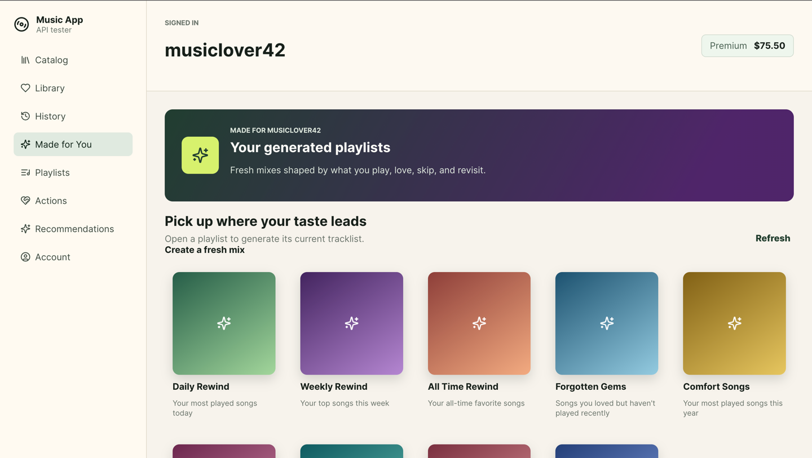
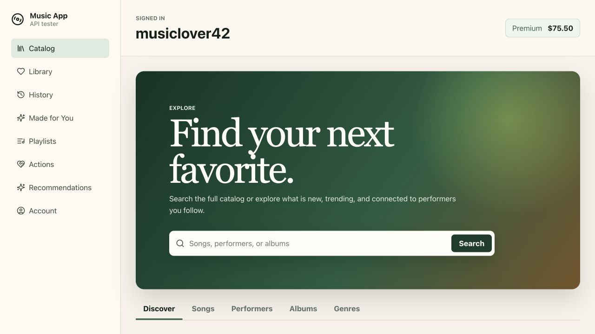
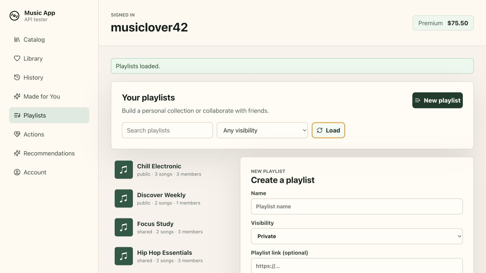
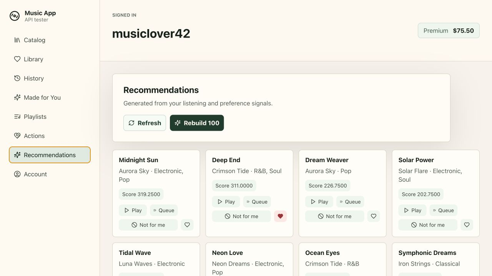

# Music App

A full-stack music platform built with Spring Boot, React, PostgreSQL, and Flyway. Browse a seeded catalog, manage playlists, and get personalised recommendations through a session-authenticated API.

## Highlights

- Music discovery, search, library activity, playlists, and recommendations
- Spring Security, PostgreSQL persistence, and versioned database migrations
- React frontend with API and browser-journey tests

## Screenshots

<p>
  
  
</p>
<p>
  
  
  
</p>

## Run locally

You’ll need Java 21+, Maven 3.9+, Node.js 22+, pnpm 10+, and Docker Desktop.

```bash
# Start PostgreSQL
docker compose up -d

# Start the API
mvn spring-boot:run
```

In a second terminal, start the frontend:

```bash
cd frontend
pnpm install --frozen-lockfile
pnpm dev
```

Open [http://localhost:5173](http://localhost:5173). The API runs on [http://localhost:8080](http://localhost:8080), and Flyway loads the schema and sample data on startup.

## Checks

```bash
mvn test
cd frontend && pnpm test && pnpm build
```

Run `cd frontend && pnpm test:e2e` for the browser journey tests.
